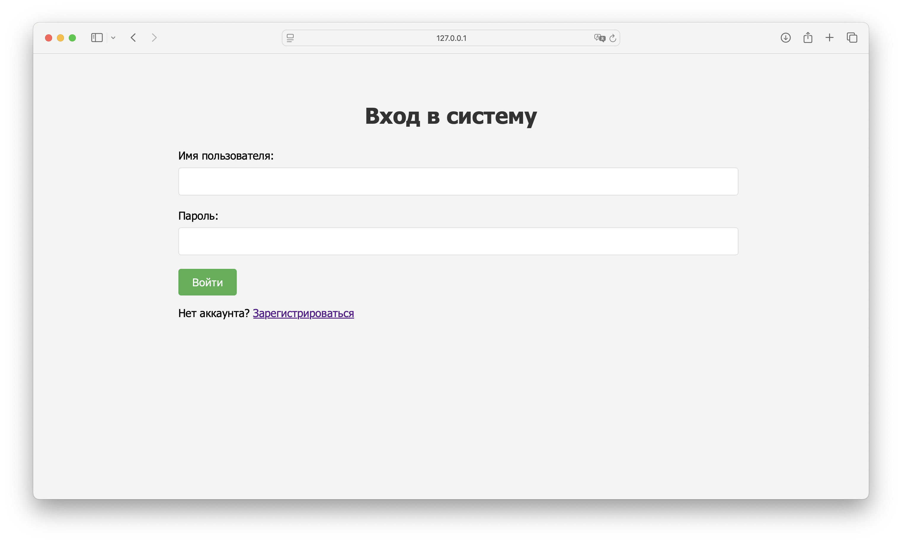

# Flask Authentication with MongoDB

This project was created for the Web Application Development course at ITMO University.

This is a Flask web application with user authentication and profile functionality. User data is stored in MongoDB.

## Implemented Features

### Basic Part:
- Application runs on localhost:5000
- Authentication form at http://localhost:5000/
- Redirection to profile page after successful authentication
- Profile page is only accessible to authenticated users (http://localhost:5000/profile)
- Usernames and passwords are stored in MongoDB

### Advanced Part:
- Registration of new users
- Password hashing for security
- Logout functionality
- Password change functionality
- Profile photo updates (new users receive a default photo)
- Profile information editing (name, bio)

## Project Structure

```
flask-auth-app/
├── app.py               # Main application file
├── .env.example         # Example environment variables file
├── static/
│   ├── css/
│   │   └── style.css    # CSS styles
│   └── uploads/         # Folder for profile photo uploads
│       └── default.png  # Default profile image
└── templates/           # HTML templates
    ├── index.html       # Login page
    ├── profile.html     # Profile page
    ├── register.html    # Registration page
    ├── update_profile.html  # Profile update page
    └── change_password.html # Password change page
```

## Installation and Running

1. Clone the repository:
```bash
git clone https://github.com/itmo-wad/Dmitriev-hw2.git
cd Dmitriev-hw2
```

2. Install dependencies:
```bash
pip install Flask Flask-PyMongo Werkzeug python-dotenv
```

3. Set up MongoDB using Docker:
```bash
docker run --name mongodb -d -p 27017:27017 mongo:latest
```

4. Configure the environment by copying `.env.example` and renaming it to `.env`, then editing the required parameters as desired:

| Parameter | Description |
|-----------|-------------|
| `SECRET_KEY` | Your super secret key for Flask sessions and security |
| `MONGO_URI` | MongoDB connection string (default: mongodb://localhost:27017/flask_auth_db) |


5. Run the application:
```bash
python app.py
```

6. Open a browser and navigate to http://localhost:5000/

## Screenshots



